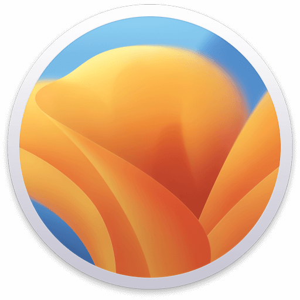

# yrotak
👋 Hi my name is yrotak I'm developer since my young ages and I really like computer science, cryptography and math. I'm open for any project.

Main languages: `C++ & Javascript & Rust`

## 🖋️Programming language:

## 💻 Operating system

 
Main

 
Dual boot

 
Macbook pro m1

## 👨‍🎓What I want to learn:
- Carbon

## 📈 GitHub stats

## 📚Languages:
- French (Native)
- English (Fluent)
- Spanish (Basic)

#### Have a nice day 👌

*Judge a fish by its ability to climb a tree, it will live its whole life believing that it is stupid*
