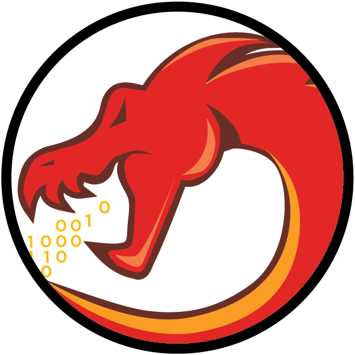

<div align="center">


<a href="https://github.com/yrotak">
  
</a>

<br/>


</div>

## `> whoami`

```console
yrotak@epita:~$ whoami
Yrotak  —  Reverse Engineer & Developer
Student @ EPITA

yrotak@epita:~$ cat ./focus.txt
Reverse engineering (.NET / C++ / C / JS), cheats & anti-cheat internals,
low-level systems and self-hosted infrastructure.

yrotak@epita:~$ echo $MAIN_LANGUAGES
C++   Rust

yrotak@epita:~$ ls ~/interests/
binary_analysis/   anti_cheat/   homelab/   sysadmin/   rigorous_projects/

yrotak@epita:~$ sudo ./hire_me.sh
[+] Status .......... open to opportunities
[+] Mindset ......... rigor, curiosity, deep technical work
```

<div align="center">

### Experience


&nbsp;

&nbsp;


</div>

## `> tech_stack`

<div align="center">

<table>
  <tr valign="middle">
    <td align="right"></td>
    <td align="left"></td>
  </tr>
  <tr valign="middle">
    <td align="right"></td>
    <td align="left">
      
      
    </td>
  </tr>
  <tr valign="middle">
    <td align="right"></td>
    <td align="left"></td>
  </tr>
  <tr valign="middle">
    <td align="right"></td>
    <td align="left"></td>
  </tr>
  <tr valign="middle">
    <td align="right"></td>
    <td align="left"></td>
  </tr>
  <tr valign="middle">
    <td align="right"></td>
    <td align="left">
      
      
      
    </td>
  </tr>
</table>

</div>

## `> reverse_engineering`

> Strong experience reversing **.NET**, **C++**, **C** and **JavaScript** targets — including deep knowledge of **modern & sophisticated game cheats and anti-cheats**.

**Toolkit**

<div align="center">
<table>
  <tr align="center">
    <td><br/><sub>Ghidra</sub></td>
    <td><br/><sub>IDA Pro</sub></td>
    <td><br/><sub>x64dbg</sub></td>
    <td><br/><sub>Cheat Engine</sub></td>
    <td><br/><sub>Detect It Easy</sub></td>
    <td><br/><sub>ReClass.NET</sub></td>
  </tr>
</table>
</div>

**Domains:** anti-cheat internals & evasion · binary analysis · unpacking · memory manipulation · obfuscation / deobfuscation

## `> sysadmin & homelab`


- **Virtualization / orchestration:** Proxmox, Ansible playbooks
- **Networking:** MikroTik (RouterOS), fiber connectivity — ONT, GPON
- **Identity:** Authentik, SSO & OAuth
- **Systems:** RHEL, administration best practices, hardening & common vulnerabilities
- **Personal lab:** fully self-hosted infrastructure

> 🏠 **Homelab setup & infra → [github.com/yrotak/infrastructure](https://github.com/yrotak/infrastructure)**

## `> ctf & platforms`

<div align="center">

<a href="https://app.hackthebox.com/profile/019ee18c-5d93-732f-8a46-692c81510861">
  
</a>

<br/>


<br/>

<a href="https://app.hackthebox.com/profile/019ee18c-5d93-732f-8a46-692c81510861"></a>
<a href="https://www.root-me.org/DrayNeur"></a>
<a href="https://leetcode.com/yrotak"></a>

</div>

## `> certifications`

| Certification | Issuer | Status |
|:--|:--|:--:|
|  | Cisco Networking Academy |  |
|  | Cisco Networking Academy |  |
| -EE3124?style=for-the-badge&logo=fortinet&logoColor=white) | Fortinet |  |
|  | Qualys |  |
|  | Splunk |  |
|  | freeCodeCamp |  |


## `> github_stats`

<div align="center">


<br/>


</div>

## `> activity`

<div align="center">


</div>

## `> contact`

<div align="center">

<a href="https://github.com/yrotak"></a>
<a href="https://app.hackthebox.com/profile/019ee18c-5d93-732f-8a46-692c81510861"></a>
<a href="https://www.root-me.org/DrayNeur"></a>
<a href="https://leetcode.com/yrotak"></a>

<br/>

<!-- <a href="https://linkedin.com/in/LINKEDIN_USERNAME"></a>
<a href="mailto:YOUR_EMAIL"></a> -->

</div>


